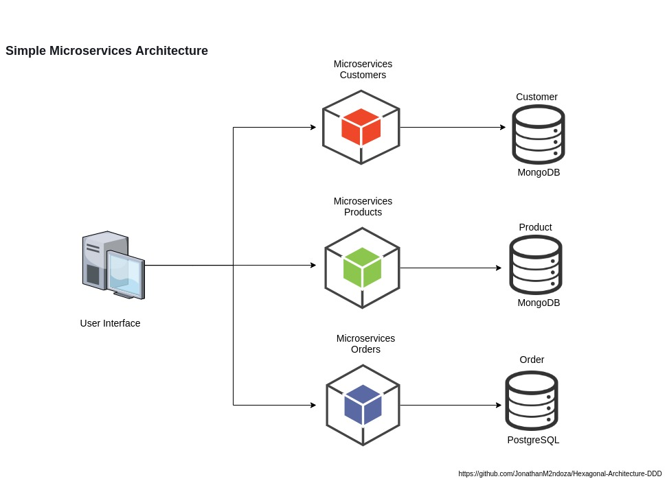

# Hexagonal-Architecture-DDD

Example of how to use Hexagonal Architecture with Microservices, S.O.L.I.D Principles and the basic of Domain Driven Design (DDD) 

This example is made with Spring Boot, MongoDB, PostgreSQL

## Domain Driven Design (DDD)

Domain-Driven Design is an approach to software development that centers the development on programming a domain model that has a rich understanding of the processes and rules of a domain.

Bounded Context is a central pattern in Domain-Driven Design. It is the focus of DDD's strategic design section which is all about dealing with large models and teams. DDD deals with large models by dividing them into different Bounded Contexts and being explicit about their interrelationships.

*Reference:*
- https://martinfowler.com/tags/domain%20driven%20design.html

## Hexagonal Architecture

The hexagonal architecture, or ports and adapters architecture, is an architectural pattern used in software design. It aims at creating loosely coupled application components that can be easily connected to their software environment by means of ports and adapters. This makes components exchangeable at any level and facilitates test automation.

The business logic interacts with other components through ports and adapters. This way, we can change the underlying technologies without having to modify the application core.

**The hexagonal architecture is based on three principles and techniques:**

1. Explicitly separate Application, Domain, and Infrastructure
2. Dependencies are going from Application and Infrastructure to the Domain
3. We isolate the boundaries by using Ports and Adapters

Note: The words Application, Domain and Infrastructure do not come from the original article but from the frequent use of hexagonal architecture by Domain-Driven Design practitioners. 

**Note: A port in Java is an interface. An adapter is one implementation of that interface.**

### Domain Layer, in the center

- The domain layer represents the inside of the application and provides ports to interact with application use cases (business logic).

- This is the part that we want to isolate from both left and right sides. It contains all the code that concerns and implements business logic (use cases).
 
- Because domain objects have no dependencies on other layers of the application, changes in other layers don’t affect them.

### Application Layer, on the left

- The application layer provides different adapters for outside entities to interact with the domain through the port.

- This is the side through which the user or external programs will interact with the application. It contains the code that allows these interactions. Typically, your user interface code, your HTTP routes for an API, your JSON serializations to programs that consume your application are here.

### Infrastructure Layer, on the right

- Provide adapters and server-side logic to interact with the application from the right side. Server-side entities, such as a database or other run-time devices, use these adapters to interact with the domain.

- It contains essential infrastructure details such as the code that interacts with your database, makes calls to the file system, or code that handles HTTP calls to other applications on which you depend for example.

*Reference:*
- https://en.wikipedia.org/wiki/Hexagonal_architecture_(software)
- https://dzone.com/articles/hexagonal-architecture-in-java-2
- https://blog.octo.com/en/hexagonal-architecture-three-principles-and-an-implementation-example/#principles

## Microservices Architecture

In our example we will use the basic architecture above without API Gateway. Customer, Product, Order do not necessarily have to be in different databases, it depends on the bounded context. The main objective is to highlight the use of Hexagonal Architecture in the microservices code. 

All microservices are implemented with Spring Boot, however microservices can be implemented with different technologies.
